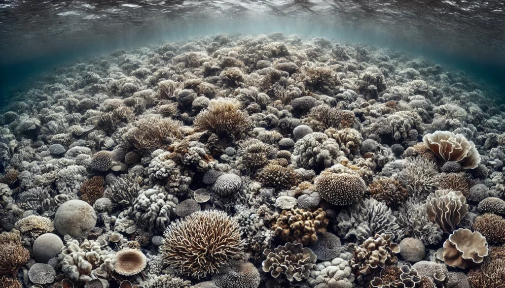
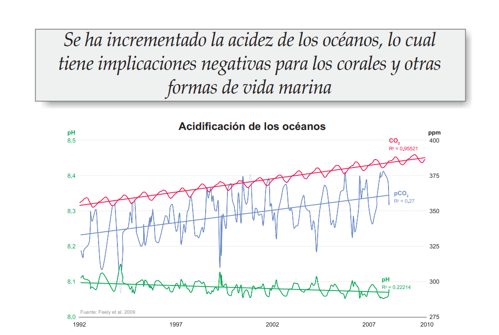
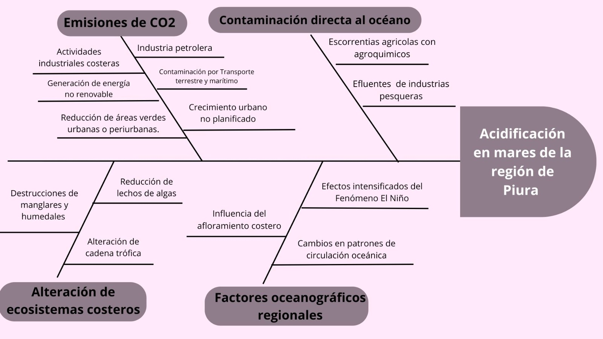

<h1 align="center">Definición del Problema</h1>

##  ¿Que es la acidificación?

La acidificación de los océanos es una consecuencia directa del aumento de dióxido de carbono (CO₂) en la atmósfera, generado principalmente por la quema de combustibles fósiles y la deforestación. Los océanos han actuado como un amortiguador natural, absorbiendo aproximadamente el 30% de estas emisiones, lo que ha reducido progresivamente su pH. Desde la Revolución Industrial, el pH oceánico ha disminuido en 0.1 unidades, lo que representa un aumento del 26% en la acidez del agua. Aunque esta variación parece pequeña, su impacto en los ecosistemas marinos es profundo y progresivo, afectando la química del agua y la capacidad de los organismos marinos para sobrevivir y desarrollarse.

  
 

  Fuente : PUCP

Uno de los grupos más afectados por la acidificación son los organismos calcificantes, aquellos que dependen del carbonato de calcio para formar sus estructuras, como corales, moluscos y ciertos tipos de fitoplancton. A medida que el pH del océano disminuye, la concentración de iones de carbonato se reduce, dificultando el proceso de calcificación. Como resultado, los corales experimentan un debilitamiento de sus esqueletos, lo que los hace más vulnerables a la erosión, enfermedades y otros factores de estrés ambiental como el aumento de la temperatura del agua y la contaminación. De manera similar, especies de moluscos como ostras, mejillones y almejas enfrentan dificultades para formar sus conchas, lo que compromete su supervivencia y el equilibrio ecológico de los ecosistemas costeros.

La acidificación de los océanos no solo afecta a los organismos calcificantes, sino que también tiene un impacto en las cadenas tróficas marinas. Muchas especies de peces dependen de pequeños organismos planctónicos como fuente de alimento. La disminución de estos organismos podría generar efectos en cascada en toda la red alimentaria, reduciendo las poblaciones de peces comerciales como el bacalao, el atún y la merluza. Esto representa un riesgo económico significativo para comunidades costeras que dependen de la pesca como fuente principal de ingresos y alimentación.

Otra consecuencia preocupante de la acidificación es su relación con la capacidad del océano para regular el ciclo del carbono. Bajo condiciones normales, los océanos actúan como un sumidero de carbono, ayudando a reducir la cantidad de CO₂ en la atmósfera. Sin embargo, la acidificación altera este equilibrio y puede reducir la eficiencia del océano en la absorción de CO₂, lo que a su vez acelera el cambio climático. Esta retroalimentación negativa podría intensificar fenómenos como el aumento del nivel del mar, la alteración de las corrientes oceánicas y la pérdida de hábitats costeros.

## 1. Impacto Social

### 1.1 A Nivel Mundial

La acidificación oceánica representa una amenaza crítica para millones de personas en todo el mundo, especialmente para las comunidades que dependen directamente de los recursos marinos. En Asia Sudoriental, la situación es particularmente alarmante, donde entre el 70% y 90% de la pesca depende de los arrecifes de coral. A medida que los océanos absorben más dióxido de carbono, se vuelven más ácidos, causando la disolución de los esqueletos y conchas de organismos marinos, lo que debilita fundamentalmente estos ecosistemas vitales.
Este fenómeno tiene consecuencias devastadoras para la seguridad alimentaria global. Los moluscos, cruciales para la cadena alimentaria marina, están particularmente en riesgo. La creciente acidez dificulta la formación de sus conchas, reduciendo dramáticamente sus poblaciones. Para las comunidades costeras que dependen de la pesca como fuente principal de proteínas y medio de subsistencia, esto significa una amenaza existencial directa a su forma de vida tradicional y su economía local.

  
 

  Fuente : PNUMA

Las regiones polares son especialmente vulnerables, con el Océano Ártico experimentando cambios más rápidos y severos en su química oceánica. Estas áreas, que ya tienen aguas naturalmente ricas en CO2, están sufriendo transformaciones que amenazan los frágiles ecosistemas y las comunidades indígenas que han dependido históricamente de estos recursos marinos para su supervivencia.
El impacto se extiende más allá de la pesca. Los pequeños estados insulares están especialmente en riesgo, ya que la degradación de los arrecifes de coral compromete no solo su economía pesquera, sino también su protección natural contra tormentas y la elevación del nivel del mar. Esto puede llevar a desplazamientos poblacionales, pérdida de territorios y disrupciones sociales masivas.
La dimensión económica del problema es igualmente preocupante. La acuicultura, el turismo marino y otras industrias relacionadas con los océanos se verán severamente afectadas. Las comunidades costeras podrían experimentar una reducción significativa de ingresos, lo que provocaría migration, desempleo y posibles conflictos por recursos cada vez más escasos.
Desde una perspectiva global, la acidificación oceánica amplifica las desigualdades existentes. Las comunidades más pobres y dependientes de los recursos marinos serán las más afectadas, sin tener los recursos para adaptarse rápidamente a estos cambios dramáticos. Esto significa que las poblaciones que menos han contribuido al cambio climático serán las que experimenten sus consecuencias más severas.
La transformación de los océanos va más allá de lo económico y ecológico; tiene profundas implicaciones culturales. Muchas comunidades tienen conexiones milenarias con el mar, con tradiciones y formas de vida estrechamente ligadas a los ecosistemas marinos. La acidificación amenaza directamente estas culturas,poniendo en riesgo conocimientos tradicionales, prácticas ancestrales y la identidad misma de estas comunidades.

### 1.2 A Nivel Nacional

La Corriente de Humboldt, un ecosistema marino único y altamente productivo, está en el epicentro de una transformación crítica debido a la acidificación oceánica. En las próximas dos o tres décadas, se esperan manifestaciones significativas que podrían tener consecuencias devastadoras para la economía peruana, especialmente en los sectores pesquero y acuícola.
Los organismos calcificantes, fundamentales para la acuicultura peruana, serán los más vulnerables. La alteración en la composición fisicoquímica del agua provocará una disminución dramática en su capacidad de formar estructuras calcáreas, lo que representa un riesgo directo para especies como moluscos y crustáceos. Esta transformación no solo amenaza la biodiversidad marina, sino que compromete directamente los medios de vida de miles de pescadores y acuicultores a lo largo del litoral peruano.
La situación se complica por la interacción de múltiples fenómenos oceánicos. La acidificación no actúa de manera aislada, sino que se combina con otros procesos como la desoxigenación y las floraciones algales nocivas, creando un escenario de múltiples amenazas para los ecosistemas marinos. Las Zonas Mínimas de Oxígeno, naturalmente presentes en el mar peruano, podrían expandirse, reduciendo significativamente el hábitat de recursos pelágicos cruciales.
Las bahías peruanas, como Paracas, son particularmente vulnerables. Los eventos de hipoxia ya documentados podrían intensificarse, provocando mortalidad masiva de invertebrados bentónicos y disrupciones significativas en la cadena alimenticia marina. La estratificación oceánica en aumento podría eliminar microestructuras ecológicas fundamentales que sostienen la vida marina desde el plancton hasta los depredadores superiores.
Las Floraciones Algales Nocivas (FAN) representan otro factor de riesgo crítico. Aunque naturales, estas floraciones están aumentando en intensidad y frecuencia debido al cambio climático. El Instituto del Mar del Perú (Imarpe) ha documentado un incremento sostenido en especies potencialmente tóxicas, lo que podría provocar daños significativos a los ecosistemas y a las actividades económicas dependientes del mar.
El impacto económico y social será profundo. Se proyecta una potencial pérdida de productividad que afectará directamente el empleo y el sustento económico de las comunidades costeras. La seguridad alimentaria está en riesgo, ya que la reducción de biomasa de recursos hidrobiológicos podría comprometer el acceso a proteínas marinas para millones de peruanos.
La contaminación adicional proveniente de residuos industriales y domésticos amplifica la vulnerabilidad de estos ecosistemas, creando un escenario complejo donde múltiples presiones amenazan la resiliencia del ecosistema marino peruano.

### 1.3 A Nivel Regional
En la ciudad de Piura, la principal fuente de emisión de dióxido de carbono (CO₂) proviene del uso de combustibles fósiles, especialmente del transporte vehicular y de la generación eléctrica mediante gas natural. Se estima que durante las horas punta en avenidas de alto tráfico, contribuyen a una emisión diaria aproximada de 15 toneladas de CO₂ solo por transporte urbano (MGI City Lab Piura, 2022). A nivel general, las proyecciones señalan un preocupante aumento de las emisiones, pasando de 2,000 ktCO₂eq en 2018 a más de 12,000 ktCO₂eq en 2040, lo que implica un crecimiento de 2.8 a 15 toneladas de CO₂ per cápita (MGI City Lab Piura, 2022). Además, se ha calculado que el 69.52% de la huella de carbono institucional en la región norte proviene del consumo de energía importada, evidenciando la gran dependencia de fuentes no renovables (ISA REP, 2023). Estos datos demuestran que Piura ya enfrenta una situación significativa de contaminación por CO₂, con un panorama ambiental que, de no mitigarse, podría agravarse considerablemente en las próximas décadas.
*(imagen 1)*
De acuerdo con la normativa peruana vigente, específicamente el Decreto Supremo N.º 004-2017-MINAM, que establece los Estándares de Calidad Ambiental (ECA) para agua, y el Decreto Supremo N.º 010-2008-PRODUCE, que regula los Límites Máximos Permisibles (LMP) para efluentes provenientes de actividades acuícolas, se establece que el rango adecuado de pH en ambientes marino costeros debe mantenerse entre 7.0 y 8.5. En ese marco, se reconocen cuatro categorías principales según el tipo de uso de estas aguas: la Categoría C1, que corresponde a la extracción y cultivo de moluscos, equinodermos y tunicados; la Categoría C2, destinada a la extracción y cultivo de otras especies hidrobiológicas; la Categoría C3, que incluye actividades marino portuarias, industriales o de saneamiento; y la Categoría C4, referida a la extracción y cultivo de especies hidrobiológicas en ambientes continentales, como lagos o lagunas.

En cuanto a los valores específicos de pH, se considera adecuado un rango de 7.0 a 8.5 para la categoría C1, mientras que para la C2 se permite un rango un poco más amplio, de 6.8 a 8.5. Estas referencias se basan en los resultados de monitoreos ambientales realizados en zonas de producción acuícola a lo largo del litoral peruano, y son fundamentales para garantizar el bienestar de las especies cultivadas, así como para prevenir impactos negativos sobre el ecosistema marino costero.
*(imagen 2)*
Según el "Diagnóstico Socioeconómico y Ambiental de la Zona Marino Costera de la Provincia de Paita", elaborado por el Gobierno Regional Piura, la playa El Toril, ubicada en la bahía de Paita, es una de las más contaminadas de la región. Esta playa, donde se realiza pesca artesanal, presenta niveles de contaminación que la hacen no apta para bañistas. Aunque no se dispone de datos específicos sobre el pH del agua en esta área, la alta carga de contaminantes podría estar contribuyendo a procesos de acidificación, afectando tanto a los ecosistemas marinos como a las actividades pesqueras locales.

## 2. Contexto Económico

### 2.1 A Nivel Mundial
Aunque la acidificación oceánica ha sido abordada sobre todo desde la ciencia biológica, su impacto económico todavía no ha recibido la atención que merece. Los pocos estudios que existen, como el de Moore y Fuller (2020), advierten que este fenómeno representa un riesgo real para la economía marina, especialmente para la producción de especies como los moluscos, que dependen de condiciones químicas estables en el océano para sobrevivir. Según sus estimaciones, las pérdidas económicas globales podrían alcanzar entre 47 y 58 dólares por persona hacia el año 2100. Desde el punto de vista económico, la acidificación se entiende como un choque negativo de oferta: al disminuir la disponibilidad y calidad de los productos del mar, se ve afectada directamente la producción global ligada a los océanos, sobre todo la captura marina, que es la forma más común y barata de pescar. En respuesta, la acuacultura, la crianza en ambientes controlados ha tomado fuerza como alternativa, aunque no logra compensar completamente la caída en la pesca tradicional. Esto no solo impacta a los pescadores y productores, sino también a toda la cadena de valor y a comunidades enteras que viven del mar, como ocurre en países costeros o insulares, donde las economías son especialmente vulnerables. Además, hay otros efectos indirectos que muchas veces se pasan por alto, como la caída del turismo marino o los cambios en los precios al consumidor. Al centrarse en tendencias globales y a largo plazo, los estudios muestran que la acidificación oceánica ya está teniendo consecuencias económicas importantes, y todo indica que estas seguirán creciendo si no se actúa a tiempo.

### 2.2 A Nivel Regional
La pesca extractiva e industrial ha sido históricamente una actividad clave, aunque su participación en el PBI nacional entre 2017 y 2021 fue relativamente modesta, con un promedio de 1.3%. Sin embargo, su impacto económico va mucho más allá de esa cifra. En 2022, el sector enfrentó una fuerte contracción: la pesca y acuicultura cayeron en 13.7%, mientras que la manufactura asociada, como conservas, productos congelados, harina y aceite de pescado, también sufrió retrocesos importantes, con caídas de 6.4% y 23.8%, respectivamente. A pesar de este escenario, las exportaciones pesqueras representaron el 7% del total nacional, alcanzando los 4,021 millones de dólares, lo que significó un ligero crecimiento respecto al año anterior. Productos emblemáticos como la harina y el aceite de pescado también mostraron aumentos, con ingresos de 1,816 y 564 millones de dólares, respectivamente. Departamentos como Piura, Lima y Áncash lideran el valor agregado bruto del sector, concentrando en conjunto el 63% de la actividad pesquera del país, una tendencia que se mantiene desde hace más de una década. La pesca industrial no solo genera empleo directo, sino que también dinamiza otras ramas de la economía: por cada sol producido, se estima un efecto de arrastre del 63% en ventas y consumo en otros sectores. En términos fiscales, la actividad generó S/ 712.6 millones en tributos solo en 2022, con un crecimiento del 60% respecto a 2021, destacando el papel de la manufactura, que aportó el 70.6% de esa recaudación. Además, el canon pesquero, que corresponde a fondos que regresan a las regiones, sumó S/ 114.9 millones, beneficiando principalmente a los gobiernos locales. Estos datos reflejan no solo la importancia económica del sector, sino también su rol estratégico para muchas regiones costeras y la necesidad urgente de protegerlo frente a desafíos como la acidificación oceánica.

## 3. Diagrama de Ishikawa - Causa y Efecto

  
 

  Fuente : PUCP

## 4. Mapa de Viaje del Cliente
*[Espacio para insertar imagen]*

## 5. Definición Formal del Problema
*[Espacio para insertar imagen]*

## REFERENCIAS BIBLIOGRÁFICAS
*[Espacio para agregar referencias]*
